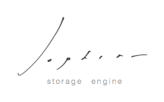

	

# Sophia 2.2 Manual

Welcome to the Sophia 2.2 Manual.

[Sophia](http://sophia.systems) is advanced transactional [MVCC](http://en.wikipedia.org/wiki/Multiversion_concurrency_control)
key-value/row storage library. Open-Source, available free of charge under terms of [BSD License](tutorial/license.md).

### How does it differ from other storages?

Sophia is RAM-Disk hybrid storage. It is designed to provide best possible on-disk performance without degradation
in time. It has guaranteed *O(1)* worst case complexity for read, write and range scan operations.

It adopts to expected write rate, total capacity and cache size.

### What is it good for?

For server environment, which requires
lowest latency access (both read and write), predictable behaviour, optimized storage schema and transaction guarantees.

It can efficiently work with large volumes of ordered data, such as a time-series,
analitycs, events, logs, counters, metrics, etc.

Bindings for the most common languages are available [here](http://sophia.systems/drivers.html).

### Features

* Full ACID compliancy
* MVCC engine
* Optimistic, non-blocking concurrency with N-writers and M-readers
* Pure Append-Only
* Unique data storage architecture
* Multi-threaded compaction
* Multi-databases support (sharing a single write-ahead log)
* Multi-Statement and Single-Statement Transactions (cross-database)
* Serialized Snapshot Isolation (SSI)
* Optimized storage schema (row numeric types has a zero-cost storage)
* Can be used to build Secondary Indexes
* Upsert (fast write-only 'update or insert' operation)
* Consistent Cursors
* Prefix search
* Automatic garbage-collection
* Automatic key-expire
* Hot Backup
* Compression (no fixed-size blocks, no-holes, supported: lz4, zstd)
* Direct IO support
* Use mmap or pread access methods
* Easy to use (minimalistic API)
* Easy to write bindings (FFI-friendly)
* Easy to built-in (amalgamated source)
* Implemented as small *C-written* library with zero dependencies
* Carefully tested
* Open Source Software, BSD

