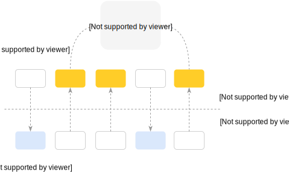

Anti-Cache Storage
------------------

<center>
</img>
</center>

<br>

Anti-Cache mode makes RAM a primary storage, while disk becomes a secondary storage.

Sophia implements the mode by introducing so-called index *Temperature*. The Temperature shows which nodes
are the most frequently accessed for read (hot). These nodes are periodically elected and promoted to
be put **in-memory**. Previously elected nodes are unloaded if they do not fit into memory limit.

Following variables can be set to enable anti-cache mode and set the memory limit: **db.database_name.storage**
and **memory.anticache**.

```C
/* set 1Gb anti-cache limit (for all databases) */
sp_setint(env, "memory.anticache", 1 * 1024 * 1024 * 1024);
/* switch a test database into anti-cache mode */
sp_setstring(env, "db.test.storage", "anti-cache", 0);
```

The election period is configurable by the following variable: **compaction.zone.anticache_period**.

```C
/* schedule anti-cache node election every 5 minutes */
sp_setint(env, "compaction.0.anticache_period", 60 * 5);
```

Database **db.database_name.temperature_histogram** can be examined to see current temperature distribution
among index.

```C
char *temperature = sp_getstring(env, "db.test.temperature_histogram", NULL);
...
free(temperature);
```

Please take a look at [Database](../conf/database.md) and [Compaction](../conf/compaction.md) configuration
sections for additional details.

For pure in-memory storage mode see [Persistent RAM Storage](../admin/ram.md) and
[Memory-Mapped Storage](../admin/ram.md) for semi-in-memory storage mode.
