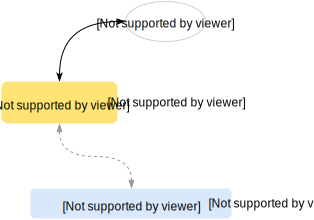

Persistent Caching
------------------

<center>
</img>
</center>

<br>

Sophia allows to use a database as a *cache* for
another one or more databases. Caching database is used to store records
which are read from main database. Caching database can be placed in [RAM](ram.md) or
Flash, while main database can be stored on HDD. Caching database has the same storage
format as a main database, it is also involved in [Compaction](compaction.md).
It must have an exact index [keys types](database.md) as the main database.

Following variable can be set to put a database into a cache mode:
**db.database_name.cache_mode**. To assign a caching database for main database
**db.database_name.cache** should be set with caching database name.

By enabling [LRU Mode](lru.md) user can create Persistent LRU Cache, otherwise
caching database will be a copy of the main database.

It is highly advisable to enable [AMQ Filter](amqf.md) for caching database.
The filter will be used to reduce cache usage during search and reduce cache washout factor
during invalidation (set, delete).

```C
/* put cache db into cache mode */
sp_setint(env, "db.cache.cache_mode", 1);
/* set size of cache as 1 Gb */
sp_setint(env, "db.cache.lru", 1 * 1024 * 1024 * 1024);
/* enable AMQ Filter */
sp_setint(env, "db.cache.amqf", 1);

/* assign cache db as a cache for the main db */
sp_setstring(env, "db.main.cache", "cache", 0);
```

After that, all transactions with main database transparently start to go
through caching database. Following logic is used:

* [sp\_get(main)](../api/sp_get.md)
	1. attempt to find a key in caching database
	2. if the key is found
		* sp_set(cache, key) to maintain LRU logic
		* return key to user
	3. attempt to find a key in main database (if not 2)
	4. if the key is found
		* sp_set(cache, key)
		* return key to user
	5. not found
* [sp\_set(main)](../api/sp_set.md)
	1. insert or replace key in main database
	2. replace (or do nothing if not found) key in caching database
* [sp\_delete(main)](../api/sp_delete.md)
	1. delete key in main database
	2. delete key in caching database


To update caching database uses [sp\_get()](../api/sp_get.md).
**multi-statement** transactions *must* be used.

Single statement operation will only make an attempt to find a record, but not
to save it back into caching database.

```C
/* multi-statement */
void *transaction = sp_begin(env);
void *doc = sp_document(main);
sp_setstring(doc, "key", key, sizeof(key));
void *record = sp_get(transaction, doc);
if (record)
	sp_destroy(record);
/* commit will maintain Cache and LRU logic by
 * inserting record into caching database with higher
 * LSN number. */
sp_commit(transaction);

/* single-statement */
void *doc = sp_document(main);
sp_setstring(doc, "key", key, sizeof(key));
/* record will not be saved in caching database */
void *record = sp_get(main, doc);
if (record)
	sp_destroy(record);
```

Upsert operation [sp\_upsert()](../api/sp_upsert.md) is not supported for the scheme.
Cursor operation [sp\_cursor()](../api/sp_cursor.md) does not use caching database and
can separately be used with caching or main database.

*Please note*: since [sp\_get()](../api/sp_get.md) statements are not involved in Write-Ahead Log,
some of the latest updates may be lost in cache database after recovery. These are records
which yet remain in-memory and yet being dumped to disk by compaction.
