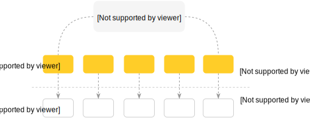

Persistent RAM Storage
----------------------

<center>
</img>
</center>

<br>

Sophia can store an exact copy of any node file into RAM.

All read requests are handled using RAM storage. The storage data continuously writing on disk
using default background compaction procedure and Write Ahead Log.

To enable RAM storage a database storage mode should be set as **in-memory**.

```C
sp_setstring(env, "db.test.storage", "in-memory", 0);
```

It is a good idea to switch Sophia into branch-less compaction mode. This mode allows to have an exact two-level
model without necessity to create additional branches (index dumps), since all data is already stored in RAM.

```C
sp_setint(env, "compaction.0.mode", 1);
```

During recovery, storage data files are read back into memory.

It is possible to enable and combine [compression](compression.md) with RAM Storage.

Memory-Mapped Mode
------------------

As an alternate way to use [Persistent RAM storage](ram.md) and [Anti-Cache](anticache.md) modes could be mmap mode.
By default Sophia uses pread(2) to read data from disk. Using mmap mode, Sophia handles all requests by
directly accessing memory-mapped node files memory.

Following variable can be set to enable or disable mmap mode: **db.database_name.mmap**

```C
sp_setint(env, "db.test.mmap", 1);
```

It is a good idea to try this mode, even if your dataset is rather small or you need to handle
a large ratio of read request with a predictable pattern.

Disadvantage of mmap mode, in comparison to RAM Storage, is a possible unpredictable
latency behaviour and a OS cache warmup period after recovery.
