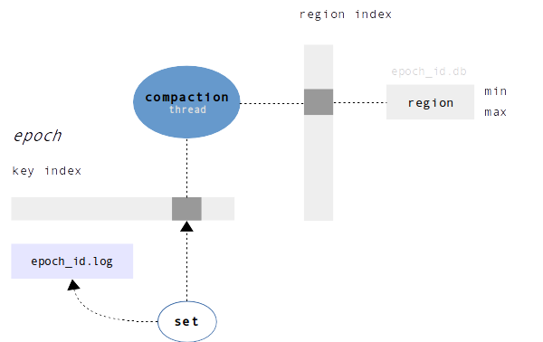

Version 1.1
-----------

Original Sophia's architecture combines a region in-memory index with an in-memory key index.

A region index is represented by an ordered range of regions with their min and max
keys and latest on-disk reference. Regions never overlap.

These regions have the same semantical meaning as the B-Tree pages, but designed differently.
They do not have a tree structure or any internal page-to-page relationships, thus no meta-data
overhead (specifically to append-only B-Tree).

A single region on-disk holds keys with values. As a B-tree page, region has its maximum
key count. Regions are uniquely identified by region id number that makes them trackable in future.

Key index is very similar to LSM zero-level (memtable), but has a different key lifecycle.
All modifications first get inserted into the index and then hold up until they are
explicitly removed by merger.

</img>

Lifecycle
---------

The database update lifecycle is organized in terms of epochs. Epoch lifetime is set in
terms of key updates. When the update counter reaches an epoch's watermark number then
the Rotation event happen.

Each epoch, depending on its state, is associated with a single log file or database file.
Before getting added to the in-memory index, modifications are first written to the
epoch's write-ahead log.

On each rotation event:

1. current epoch, so called 'live', is marked as 'transfer' which leads to a new 'live' epoch creation (new log file)
2. create new in-memory key index and swap it with current one
3. merger thread is being woken up

The merger thread is the core part that is responsible for region merging and garbage
collecting of the old regions and older epochs. On the wakeup, the merger thread
iterates through list of epochs marked as 'transfer' and starts the
merge procedure.

The merge procedure has the following steps:

1. create new database file for the latest 'transfer' epoch
2. fetch any keys from in-memory index that associated with a single destination region
3. start the merge for each fetched key and origin region, then write a new region to the database file
4. on each completed region (current merged key count is less or equal to max region key count):
  1. allocate new split region for region index, set min and max
  2. first region always has id of origin destination region
  3. link region and schedule for future commit
5. on origin region update completion:
  1. update destination region index file reference to the current epoch and insert split regions
  2. remove keys from key index
6. start step (2) until there is no updates left
7. start garbage collector
8. sync database with a disk drive, then, if everything went well, remove all 'transfer' epochs (log files) and gc'ed databases
9. free index memory

Garbage Collection
------------------

The garbage collector has a simple design.

All that you need is to track an epoch's total region count
and the count of transfered regions during merge procedure. Thus, if some older
epoch database has fewer than 70% (or any other changeable factor) live regions,
they just get copied to the current epoch database file while the
old one is being deleted.

On database recovery, Sophia tracks and builds an index of pages from the earliest
epochs (biggest numbers) down to the oldest.
Log files then are being replayed and epochs become marked as 'transfer'.

Algorithmic Complexity
----------------------

Sophia has been evaluated as having the following complexity (in terms of disk accesses):

**set** worst case is O(1) append-only key write + in-memory index insert

**delete** worst case is O(1) (delete operation is equal to set)

**get** worst case is O(1) random region read, which itself does amortized
O(log region\_key\_count) key compares + in-memory key index search + in-memory
region search

**range** range queries are very fast due to the fact that each iteration needs to
compare no more than two keys without a search, and access through mmaped
database. Roughly complexity can be equally evaluated as sequential reading
of the mmaped file.
