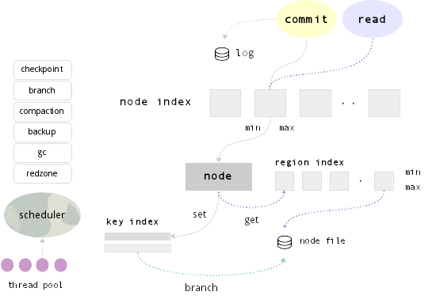

Version 1.2
-----------

There have been major changes in storage architecture since version 1.1.

Version 1.1 defines strict 2-level storage model between in-memory and
disk. It gives worst-case guarantee O(1) for any ordered key read in
terms of disk access.

This approach had its limitations, since it was unable to efficiently
maintain memory limit with required performance.
Additionally there was a need for multi-threaded compaction.

Sophia has evolved in a way that expands original ideas.
Architecture has been designed to efficiently work with memory and large amount of keys.

In fact, it became even simplier.

Design
------

Sophia's main storage unit is a Node.

Each Node represents a single file with associated in-memory region index and two
in-memory key indexes. Node file consists of Branches.

Each Branch consists of a set of sorted Regions and Region Index.

A single Region holds keys with values. It has the same semantical meaning as a
B-Tree page, but organized in a different way.
It does not have a tree structure or any internal page-to-page relationships and thus no
meta-data overhead.

A Region Index is represented by an ordered range of regions with their min
and max keys and on-disk reference. Regions never overlap.

A Key Index is very similar to LSM zero-level (memtable), but has
a different key lifecycle. All modifications first get into the index and hold up
until they are explicitly removed by the merger.

Before getting added to the in-memory Key Index, modifications are first written
to the Write-Ahead Log.

</img>

Lifecycle
---------

Database lifecycle is organized in terms of two major operations: Branch and Compaction.

When a Node's in-memory Key Index size reaches a special watermark value or global
memory limit, Branch operation is scheduled.

When some Node branch counter reaches a special watermark value, Compaction operation is scheduled.

**Branch operation**

1. rotate in-memory Key Index (use second one empty)
(Node updates during Branch goes to second index)
2. create new Regions and Region Index from Key Index
3. create new Node Branch
4. sequentially write Branch to the end of Node file
5. sync
6. free index and rotate

**Compaction operation**

1. sequentially read Node file into memory
2. create iterator for each Branch
3. merge and split key-stream:
  1. create one or more Nodes
  2. delete Node
4. sequentially write new Node or Nodes
5. sync
6. redistribute online updates between new Nodes
7. remove old Node
8. rename new Node or Nodes when completed

Optimization Game
-----------------

All background operations are planned by special scheduler.

There is a game between available memory, a number of Branches and Search times.

Each additional branch says that there is a possible additional disk access during the search.
During the search, only branch regions that have min >= key <= max are examined.
In the same time, it is unable to maintain memory limits without branching,
because compaction times are greater than possible rate of incoming data.

Sophia is designed to be read optimized. There is a high possibility that latest created Branches
(hot data) are stored in the file system cache. Scheduler is aware about nodes which have
largest in-memory Key Index and biggest number of Branches. These are processed first.

Additionally all operations are planned taking current system state in account, like
memory usage statistics, current load profiler (redzone), operations priorities, checkpoint, backup, etc.

Sophia compaction is multi-threaded. Each worker (thread) requests scheduler for a new task.
Basic unit of a background task is an operation on a single Node.

Sophia is designed to efficiently utilize available memory.
If there is more memory available, then branch/compaction operations become more infrequent and
system becomes more disk-efficient. Best performance can be obtained with no memory limit set. 
Sophia is Hard-Drive (and Flash) friendly, since all operations are delayed and
executed in large sequential reads and writes, without overwrite.

Garbage Collection
------------------

Garbage collection (MVCC related) is executed automatically by Compaction task.

Also, scheduler periodically checks if there are any nodes which have large
percentage of transactional versions (duplicates) stored per node.

Algorithmic Complexity
----------------------

Sophia has following algorithmic complexity (in terms of disk access):

**set** worst case is O(1) write-ahead-log append-only key write  + in-memory node index search + in-memory index insert

**delete** worst case is O(1) (delete operation is equal to set)

**get** worst case is amortized O(max\_branch\_count\_per\_node) random region read from a single node file, which itself does in-memory key index search + in-memory region search

**range** worst case of full database traversal is amortized O(total\_region\_count) + in-memory key-index searches for each node
