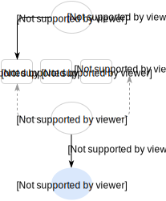

Upsert
------

</img>

 

Upsert is Update or Insert operation.

Sophia Upsert implementation allows to reduce Read-Modify-Write case
to a single Write. Updates are applied by user-supplied callback **db.database_name.index.upsert** during
data compaction or upon read request by [sp\_get()](../api/sp_get.md) or [sp\_cursor()](../api/sp_cursor.md).

To enable upsert command, a **db.database_name.index.upsert** and optionally
**db.database_name.index.upsert_arg** must be set to callback function pointer.

Please take a look at [sp\_upsert()](../api/sp_upsert.md) API for description and an example.
