How It Works
------------

To describe how Sophia works internally, we will use a simple case as
a guiding example:

* **a**. fill our empty database with the keys in random order
* **b**. read all stored keys in original order

Please take a look at the [Architecture](../arch/v12.md) manual section
for more details.

(a) Fill empty database
-----------------------

We will start by inserting 1 million random keys.

During first 200K Set operations, inserted keys first go to the
sorted in-memory index. Second, in order to maintain persistence, exact
operation information is written to write-ahead log.

 

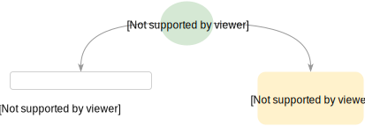</img>

 

At this point, we have 100K keys stored in-memory and the same amount
of keys written to write-ahead log.

We will continue to insert keys from 200K to 500K.

When in-memory index becomes too large, Sophia scheduler makes an attempt to
move this index from memory to disk. In-memory index dump stored on-disk
is called **Branch**. To save the branch, a new file is created.
Let's call it **db file** for now.

Branch creation process is launched in the background by one of the
dedicated Sophia worker threads. During the process, Sophia
creates a **second in-memory index** to reduce an effect on
parallel going Set operations.

Inserts are now silently go to the second index.

 

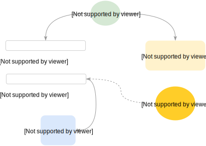</img>

 

When the Branch creation process is completed, *first in-memory index*
got freed.

 

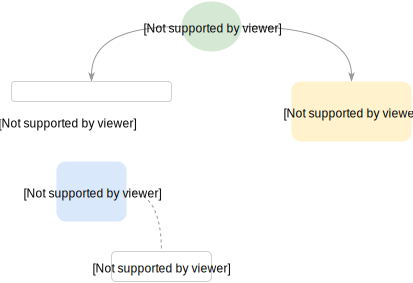</img>

 

Yet, we still keep on to inserting our keys from 500K to 700K.

The circle of in-memory index overrun and branch creation continues until the
number of created branches becomes too big. All branches are appended to the
end of **db file**.

 

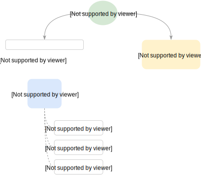</img>

 

When the number of branches hit some *watermark* number, Sophia scheduler starts
**Compaction** process for this **db file**. During the compaction process, all keys stored
in each branch are merged, which leads to creation of **one** or **more** new db files.

 

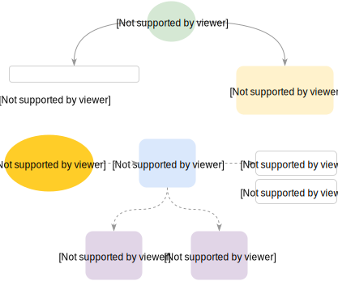</img>

 

Now we are ready to introduce new important term: each pair of
in-memory indexes and its associated db files is called a **Node** in Sophia.

 

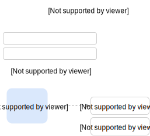</img>

 

So basically, a **Node** represents a Sophia database file which
stores a range of sorted keys. Those keys are stored in one or more Branches.

When a Node becomes too big (in terms of Branch numbers), it splits into
**two** or **more** Nodes by background thread.

It is important that each Node key is strictly separated from the other keys.
It is also crucial that Node in Sophia is a unit of such background operations like:
Branch or Compaction, Gc, Backup and so on. Several nodes can be
**processed in parallel** by Sophia worker-threads.

But let's return to our case.

At this point we have **one node** (automatically created during database deploy), which has:
(a) in-memory index with some keys in it, (b) several **Branches** (previously
sorted in-memory index dumps) are saved in the **node db file**. All operations have
been saved in WAL in serial order.

Since the number of branches became too big, Sophia scheduler starts the **Compaction**
process and creates **two** new Nodes.

 

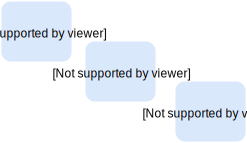</img>

 

So basically, each new created node represents a half of sorted keys
stored in original node. This applies also to in-memory index. Keys
inserted into origin in-memory index during compaction must be moved to
new node indexes. This process runs in parallel with on-going Sets, 
so efficient implementation is tricky.

When compaction process is finished, origin node is deleted too, and new 
created nodes are silently inserted into in-memory **Node Index**.

 

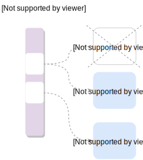</img>

 

A **Node Index** is used for correct routing during key insert or search.
Sophia is aware about min/max of each node, so this information is used
during a Node search.

 

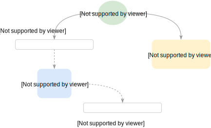</img>

 

We still continue to insert our keys. Now range varies from 700K to 1M range.

The circle of branch/compaction and node creation continues, and by
the end of insertion case our database consists of
**four** nodes.

 

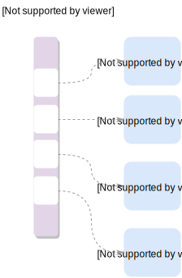</img>

 

Sophia is designed to efficiently utilize available memory.

If there is more memory available, then branch/compaction operations become
more infrequent and system becomes more disk-efficient. Best performance can be
obtained with no memory limit set. Sophia is Hard-Drive (and Flash) friendly, since
all operations are delayed and executed in large sequential reads and
writes, without overwrite.

If there is a memory-limit set, Sophia scheduler is aware about nodes
that have biggest in-memory indexes. These are processed first to efficiently
free memory.

(b) Random read
----------------

We start to read 1 million keys in origin order, which is random.

 

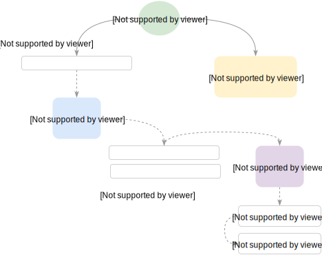</img>

 

During the Get (search), only branch regions that have
min <= key <= max are examined. When the node found, search is
performed in following structures:

1. first in-memory index
2. second in-memory index
3. each node branch: strictly starting from the last one

Branch format is highly optimized to reduce disk access during reads. Internally each
Branch consist of **Region Index** and **Sorted Regions**.

So basically, this structures splits whole Branch range of keys into smaller
regions. Region Index holds information about every Regions stored in the
Branch, their min/max values and meta-data.

 

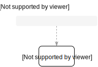</img>

 

Region Indexes are loaded into memory during database opening. They allow to
find exact region to read from disk during search and to reduce
overall search times.

There is a game between available memory, a number of Branches and Search times.
Each additional branch says that there is a possible additional disk
access during the search. In the same time, it is unable to maintain memory
limits without branching, because compaction times are greater than possible
rate of incoming data.

Sophia is designed to be read optimized. There is a high possibility that
latest created Branches (hot data) are stored in the file system cache.
Scheduler is aware about nodes which have largest in-memory Key Index and
biggest number of Branches. These are processed first.

Ideally, Sophia scheduler tries to make that each node will have 1 branch. In that case:
O(1) disk seek time is guaranteed during search.
